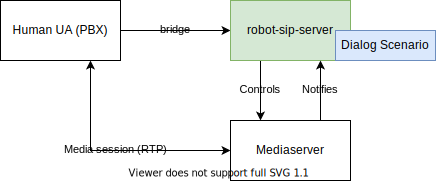

# Overview

Lightweight SIP application built on [vert.x](https://vertx.io/).

It's intended to be used as addon for full-featured PBX to implement programmable voice scenarios in Java
(see motivation).

# Motivation

Long story short:

- need to program voice dialogs
- want to do it in Java
- want to do it without 3rd-party services, on open-source stack
- want to use mature open source PBX for other telephony tasks

## State of open source Java SIP

There are several popular open-source implementations of SIP stack in JAVA, for example:

- [RestComm sip-servlets](https://github.com/RestComm/sip-servlets)
- [JAIN-SIP API reference implementation](https://github.com/RestComm/jain-sip)

JAIN-SIP-ri - [JAIN SIP API Specification](https://jcp.org/en/jsr/detail?id=32) contains low-level SIP messages
processing, SIP sessions handling (see Dialogs and Transactions) and transport layer (see SipStackImpl).

Sip-servlets - [Java SIP Servlet specification](https://jcp.org/en/jsr/detail?id=359) allows building full-featured PBX
system, uses JAIN-SIP-ri for message processing and application servers for transport layer and SIP sessions handling.

## Why robot-sip-server

We need trivial SIP application, capable of accepting incoming calls (UAS) and processing call using programmable
scenario. Specifically, we want to handle most of the call processing (like registration, initiation calls with users,
dialplans) using full-featured mature PBX and delegate IVR part to lightweight, easy to use and fun to work with Java
SIP application.

We can use sip-servlets, but there are issues:

- SIP servlets have all features to build PBX - they can be used as PBX and programmable IVR both, but popular PBXs like
  Asterisk and Freeswitch are more mature technologies, and they perfectly suited to do call processing and require less
  resources.
- SIP servlets can be used as addon to PBX to process IVR, but they have lots of non-needed for our task features - this
  involves learning curve (SIP Servlets specification) and customization, troubleshooting and debugging becomes complex.
- SIP servlets are heavy (comparing to vert.x). Available implementations of sip servlets are running on application
  servers (like Tomcat or Wildfly), and vert.x Verticles are much faster to boot and require less resources.
- Available SIP servlets implementations use blocking IO.

# Implementation

Implementation is very simple, because we implemented only needed SIP processing, basing on invariants:

## Invariants

1. UAC directly calls UAS - no proxying =>
   SipSession = Dialog = Call (between PBX and robot-sip-server); at most 1 Dialog can be established from 1 INVITE
   request.
2. No security and registration, no secure transport.
3. No reinvites.

## Results

1. Very lightweight SIP application implemented as [Verticle](https://vertx.io/docs/vertx-core/java/#_verticles)
2. Simplest possible system with minimal needed features. Trivial to undarstand and start working with.
3. Vert.x (and Quarkus if you want) and Java ecosystem

See examples module in the repository.

Also see example with media (you can call on this robot from softphone and hear phrase):
[example robot announcement](https://github.com/ivoice-tech/example-robot-announcement)

# Contributing

Project is hosted on gitlab: https://gitlab.com/ivoice-oss/robot-sip-server

Github repository is mirror.

# Reference

- [vert.x](https://vertx.io/)
- [SIP protocol](https://datatracker.ietf.org/doc/html/rfc3261)
- [JSR 359: SIP Servlet 2.0](https://jcp.org/en/jsr/detail?id=359)
- [JAIN-SIP reference implementation](https://github.com/usnistgov/jsip)
- [RestComm sip-servlets](https://github.com/RestComm/sip-servlets)
